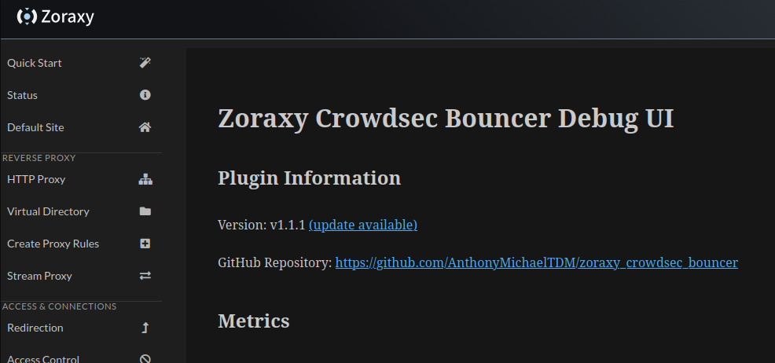
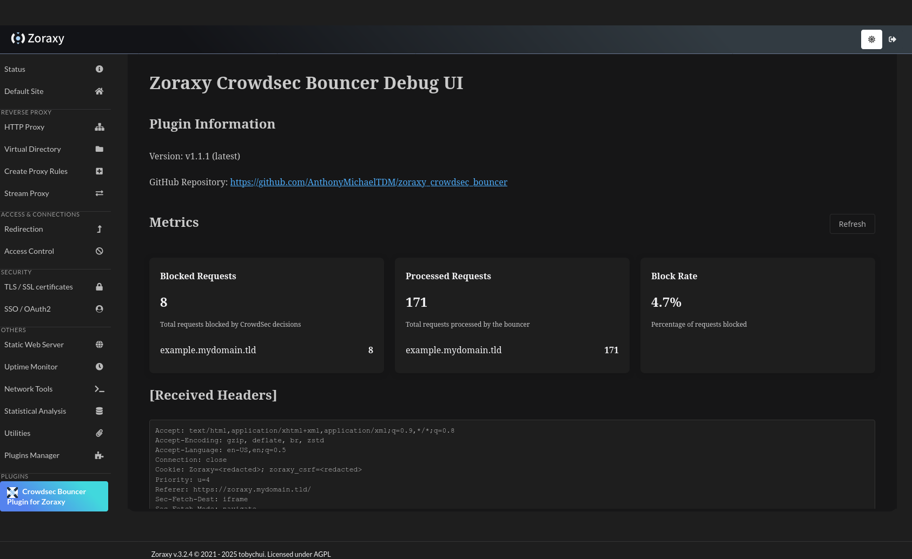
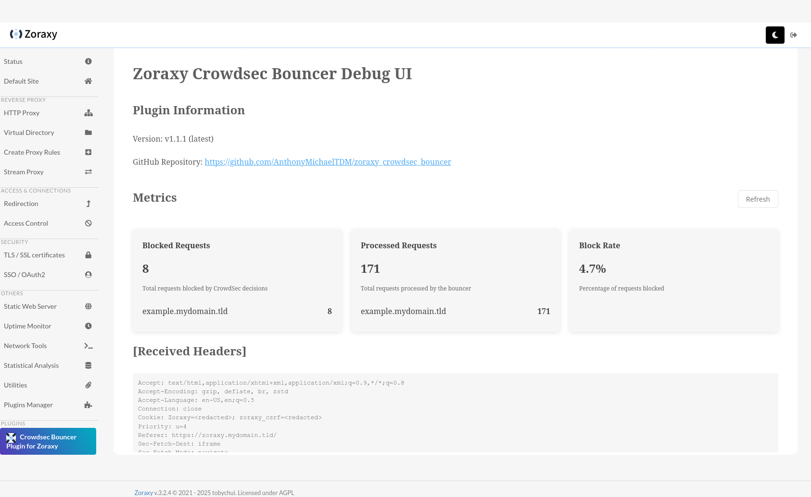

# zoraxy-crowdsec-bouncer

WIP crowdsec integration for the zoraxy reverse proxy

References:

- [Zoraxy Plugin Documentation](https://zoraxy.aroz.org/plugins/html/)
- [Crowdsec Documentation](https://docs.crowdsec.net/)
- [go-cs-bouncer](https://github.com/crowdsecurity/go-cs-bouncer)

Since this needs to look at all incoming requests, it is implemented as a [Dynamic Capture Plugin](https://zoraxy.aroz.org/plugins/html/3.%20Basic%20Examples/4.%20Dynamic%20Capture%20Example.html).

For now, it uses a live bouncer, which queries the Crowdsec API for decisions on each request. However, in the future, it should be possible to use a static bouncer that stores deicisions in an in-memory cache or file and only queries the Crowdsec API for updates periodically.

## Installation

<https://zoraxy.aroz.org/plugins/html/1.%20Introduction/3.%20Installing%20Plugin.html>

### From GitHub Releases

Create a directory for the plugin if it doesn't exist:

```bash
mkdir -p /opt/zoraxy/plugins/zoraxycrowdsecbouncer
```

Then, copy the link to the latest binary from the [releases page](https://github.com/AnthonyMichaelTDM/zoraxy_crowdsec_bouncer/releases) and use `wget` to download it to the `zoraxycrowdsecbouncer` directory:

```bash
cd /opt/zoraxy/plugins/zoraxycrowdsecbouncer
# wget <LINK_TO_LATEST_BINARY>
wget https://github.com/AnthonyMichaelTDM/zoraxy_crowdsec_bouncer/releases/download/v1.2.1/zoraxycrowdsecbouncer
chmod +x zoraxycrowdsecbouncer
```

Do the same for the `config.yaml` file:

```bash
wget https://github.com/AnthonyMichaelTDM/zoraxy_crowdsec_bouncer/releases/download/v1.2.1/config.yaml
```

### From Source

Clone the repository inside the Zoraxy plugins directory, then build the plugin:

```bash
cd /opt/zoraxy/plugins
git clone https://github.com/AnthonyMichaelTDM/zoraxy_crowdsec_bouncer.git zoraxycrowdsecbouncer

cd zoraxycrowdsecbouncer
go build
chmod +x zoraxycrowdsecbouncer
```

## Configuration

TODO: implement a way to configure the bouncer via the web UI.

in the same directory as the plugin, there should be a `config.yaml` file with some default configuration. Fill in the values as needed.

```yaml
api_key: YOUR_API_KEY
agent_url: http://127.0.0.1:8080 # for example
log_level: warning # Log level for the bouncer, options: trace, debug, info, warning, error
is_proxied_behind_cloudflare: true # Set to true if your zoraxy instance is proxied behind Cloudflare
```

You can get the API key by running the following command:

```bash
sudo cscli bouncers add zoraxy-crowdsec-bouncer
```

## Web UI

The web UI is available from the Zoraxy web interface in the "Plugins" section.

In it, you can view some basic information about the bouncer, such as the number of requests processed and dropped by the bouncer for each hostname.

Additionally, the web UI will periodically check for updates and will tell you when an update is available.



The web UI will match the theme of the Zoraxy web interface, if you have it in dark mode, the web UI will also be in dark mode.

### Dark Mode



### Light Mode


