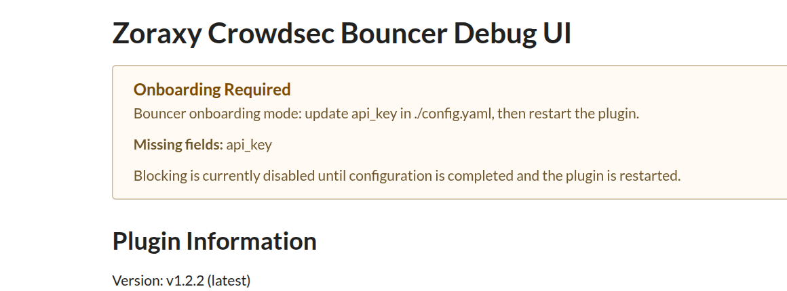
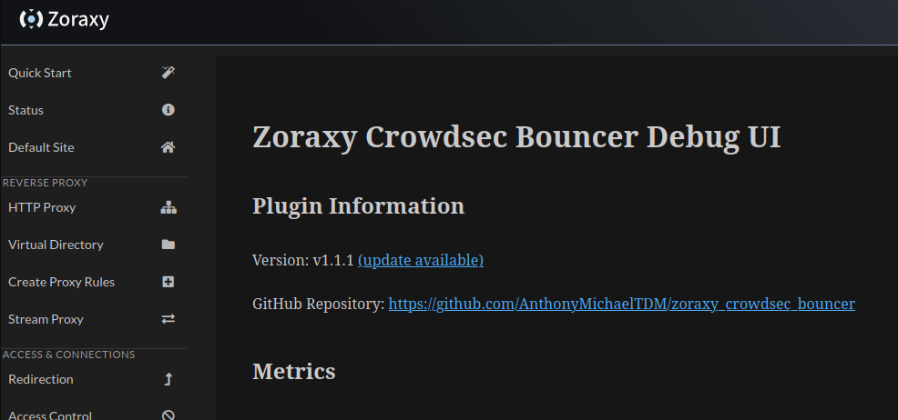
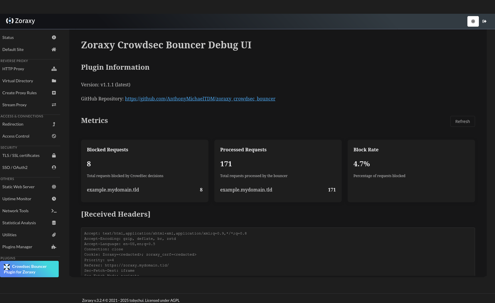
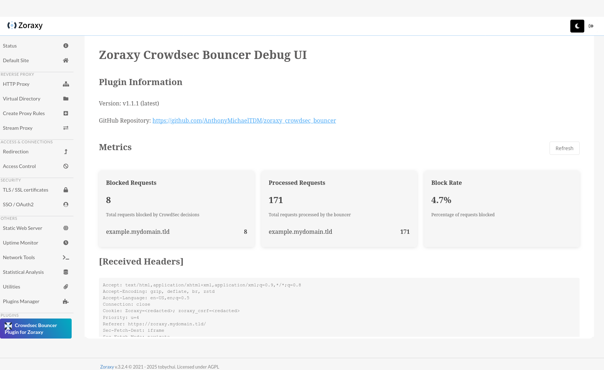

# zoraxy-crowdsec-bouncer

WIP crowdsec integration for the zoraxy reverse proxy

References:

- [Zoraxy Plugin Documentation](https://zoraxy.aroz.org/plugins/html/)
- [Crowdsec Documentation](https://docs.crowdsec.net/)
- [go-cs-bouncer](https://github.com/crowdsecurity/go-cs-bouncer)

See [CHANGELOG.md](CHANGELOG.md) for release notes.

Since this needs to look at all incoming requests, it is implemented as a [Dynamic Capture Plugin](https://zoraxy.aroz.org/plugins/html/3.%20Basic%20Examples/4.%20Dynamic%20Capture%20Example.html).

The bouncer uses CrowdSec's decision stream mode. It keeps active IP and CIDR ban decisions in memory, requests an initial snapshot at startup, and then periodically retrieves only decision deltas from CrowdSec. This avoids a Local API lookup for every proxied request.

## Installation

> [!warning]
> These instructions are assuming you have a similar setup to me, that is, are running zoraxy more-or-less bare metal (I'm using an LXC, but the idea is the same).
>
> They are known to be inaccurate if you run Zoraxy in a docker container, see the following
>
> - <https://github.com/tobychui/zoraxy/discussions/338#discussioncomment-14613481>
>
> The gist seems to be that you need to:
>
> - put your plugins in a directory that you mount to `/opt/zoraxy/plugin/` instead of `/opt/zoraxy/plugins/`
> - run crowdsec in another container on the **same virtual network** as Zoraxy (so they can talk to eachother), and make sure you mount your zoraxy logs to this container so crowdsec can monitor traffic

<https://zoraxy.aroz.org/plugins/html/1.%20Introduction/3.%20Installing%20Plugin.html>

### From the Official Plugin Store

Install the plugin from the Zoraxy plugin store, then open it from the Plugins section in the Zoraxy UI.

On first start, the plugin creates a `config.yaml` file if one does not already exist. If `api_key` is still unset, the plugin starts in onboarding mode so the UI remains available while blocking stays disabled.



To finish onboarding:

1. Open the generated `config.yaml` for the plugin.
2. Set `api_key` to a valid CrowdSec bouncer key.
3. Confirm `agent_url` points to your CrowdSec Local API.
4. Restart the plugin from Zoraxy.

### From GitHub Releases

Create a directory for the plugin if it doesn't exist:

```bash
mkdir -p /opt/zoraxy/plugins/zoraxycrowdsecbouncer
```

Then, copy the link to the latest binary from the [releases page](https://github.com/AnthonyMichaelTDM/zoraxy_crowdsec_bouncer/releases) and use `wget` to download it to the `zoraxycrowdsecbouncer` directory:

```bash
cd /opt/zoraxy/plugins/zoraxycrowdsecbouncer
# wget <LINK_TO_LATEST_BINARY>
wget https://github.com/AnthonyMichaelTDM/zoraxy_crowdsec_bouncer/releases/download/v1.2.2/zoraxycrowdsecbouncer
chmod +x zoraxycrowdsecbouncer
```

Do the same for the `config.yaml` file:

```bash
wget https://github.com/AnthonyMichaelTDM/zoraxy_crowdsec_bouncer/releases/download/v1.2.2/config.yaml
```

### From Source

Clone the repository inside the Zoraxy plugins directory, then build the plugin:

```bash
cd /opt/zoraxy/plugins
git clone https://github.com/AnthonyMichaelTDM/zoraxy_crowdsec_bouncer.git zoraxycrowdsecbouncer

cd zoraxycrowdsecbouncer
go build
chmod +x zoraxycrowdsecbouncer
```

## Post installation

After installing the plugin, and getting to the point where on the zoraxy dashboard you can see it and that it is healthy, you need to do one more thing to actually get it to work:

- add the plugin to a tag, and also add every service you want protected to the same tag.

You'll also need to do some setup with crowdsec, see <https://github.com/tobychui/zoraxy/discussions/338#discussioncomment-12566727>.

## Configuration

TODO: implement a way to configure the bouncer via the web UI.

in the same directory as the plugin, there should be a `config.yaml` file with some default configuration. Fill in the values as needed.

```yaml
api_key: YOUR_API_KEY
agent_url: http://127.0.0.1:8080 # for example
stream_update_frequency: 10s # How often to retrieve decision deltas from CrowdSec
log_level: warning # Log level for the bouncer, options: trace, debug, info, warning, error
is_proxied_behind_cloudflare: true # Set to true if your zoraxy instance is proxied behind Cloudflare
```

You can get the API key by running the following command:

```bash
sudo cscli bouncers add zoraxy-crowdsec-bouncer
```

## Web UI

The web UI is available from the Zoraxy web interface in the "Plugins" section.

In it, you can view some basic information about the bouncer, such as the number of requests processed and dropped by the bouncer for each hostname.

### Onboarding Mode

If `api_key` is not set yet, the plugin starts in onboarding mode. In this state,
the UI remains available, but blocking stays disabled until the configuration is
completed and the plugin is restarted.


Additionally, the web UI will periodically check for updates and will tell you when an update is available.



The web UI will match the theme of the Zoraxy web interface, if you have it in dark mode, the web UI will also be in dark mode.

### Dark Mode



### Light Mode



## Local E2E Testing with Docker Compose

This repository includes a [docker-compose.yml](docker-compose.yml) for local end-to-end testing.

The compose stack runs:

- Zoraxy (`zoraxydocker/zoraxy`) with mounted plugin and config directories
- CrowdSec Local API (`crowdsecurity/crowdsec`) for bouncer integration testing
- A simple internal test upstream (`test_webserver`) for proxy route testing

### Quick start (Make tasks)

Use the new dependent Make targets to bootstrap local testing:

```bash
# Onboarding flow (api_key intentionally unset)
make test-env-onboarding

# Fully configured flow (auto-generates CrowdSec API key and writes config)
make test-env-ready
```

Other helpers:

```bash
make test-env-logs
make test-env-down
```

Both `make test-env-onboarding` and `make test-env-ready` also pre-generate the
local Zoraxy config needed for this test stack:

- a proxy rule for `localhost` -> `test_webserver:5678`
- a `protected` plugin group containing `com.anthonyrubick.zoraxycrowdsecbouncer`

### 1. Build the plugin into the mounted plugin directory

```bash
mkdir -p build/plugins/zoraxycrowdsecbouncer
go build -o build/plugins/zoraxycrowdsecbouncer/zoraxycrowdsecbouncer .
chmod +x build/plugins/zoraxycrowdsecbouncer/zoraxycrowdsecbouncer
```

### 2. Start the stack

```bash
docker compose up -d
```

If Docker container picker fails in Zoraxy, set the socket path explicitly before starting compose:

```bash
export DOCKER_SOCKET_PATH="${XDG_RUNTIME_DIR}/docker.sock"
docker compose up -d
```

Open Zoraxy at <http://localhost:8000>.
The container HTTP listener is also exposed at <http://localhost:18080>.
For browser testing through Zoraxy, open <https://localhost:8443>.

### 3. Create a CrowdSec bouncer API key

```bash
docker compose exec crowdsec cscli bouncers add zoraxy-crowdsec-bouncer
```

Copy the generated API key into your plugin config file at:

```text
build/plugins/zoraxycrowdsecbouncer/config.yaml
```

When running in compose, set:

```yaml
agent_url: http://crowdsec:8080
```

### 4. Verify the preloaded Zoraxy config

The local test bootstrap preloads the proxy route and plugin group for you.

In Zoraxy, verify that:

1. the plugin is enabled from the Plugins page.
2. the `protected` plugin group contains the CrowdSec bouncer plugin.
3. the `localhost` host rule exists and is tagged with `protected`.

### 5. Test first-start and onboarding behavior

By default, the plugin creates `config.yaml` on first start if it does not exist and exits.

- If `api_key` is still unset, the plugin enters onboarding mode.
- In onboarding mode, the UI/API still works but blocking is disabled.
- The UI will show an onboarding warning.

You can verify onboarding mode in logs:

```bash
docker compose logs zoraxy | grep -i onboarding
```

### 6. Iterate on code changes

After making local code changes:

```bash
go build -o build/plugins/zoraxycrowdsecbouncer/zoraxycrowdsecbouncer .
docker compose restart zoraxy
```

### 7. Tear down

```bash
docker compose down
```
